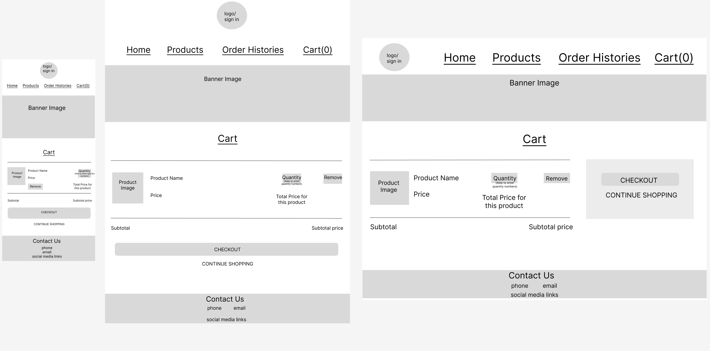
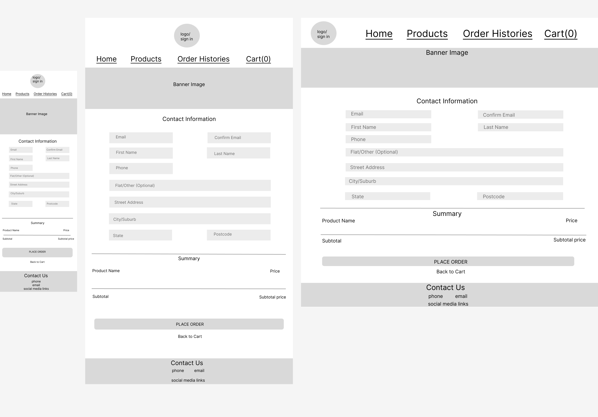
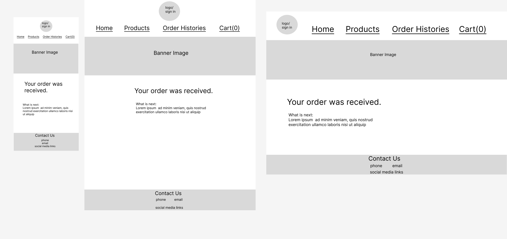
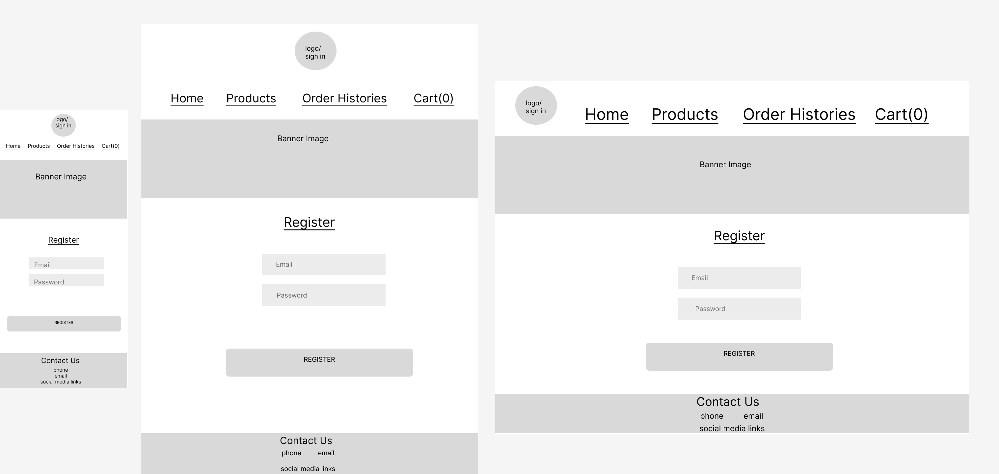
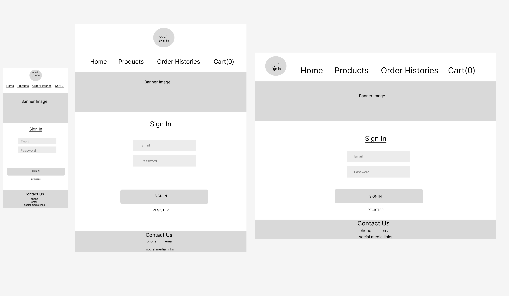
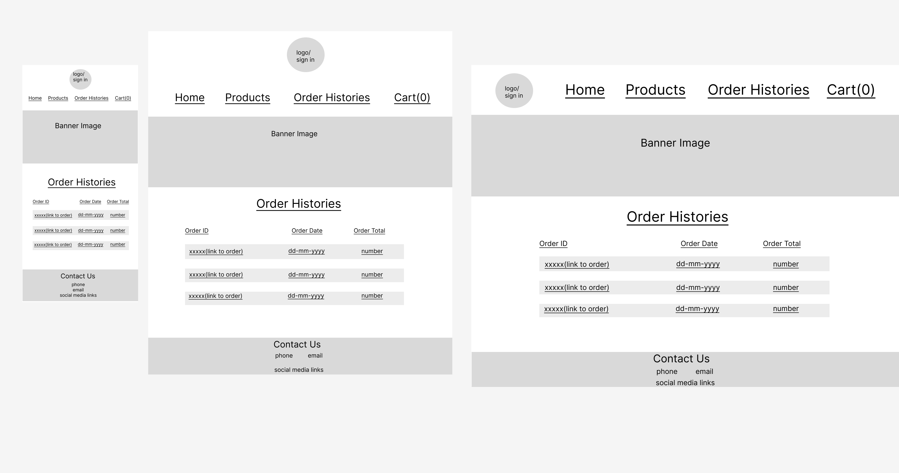
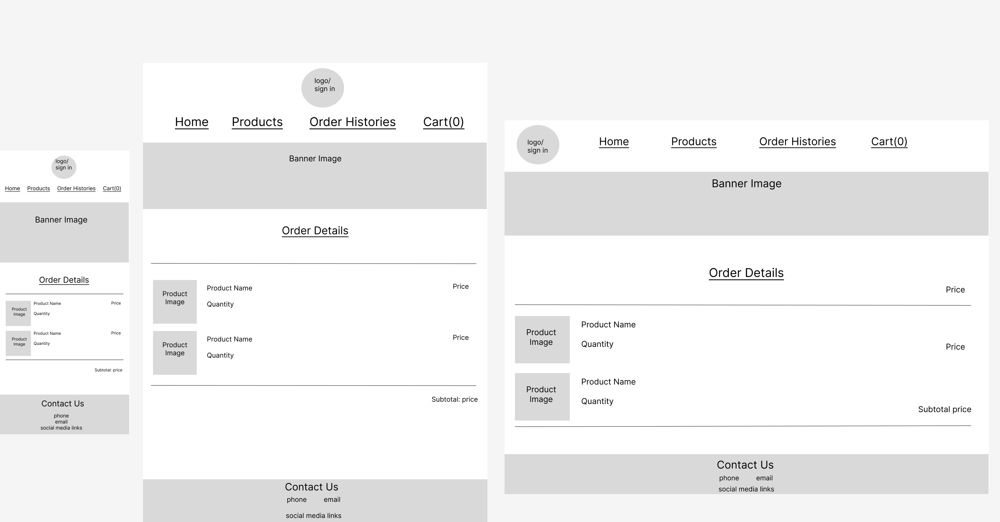

# Dan Mo and Chengqun Niu T3A2 MERN-Project-Sticker Shop

## GitHub Repo: [Part-A-Documentation](https://github.com/MERN-Project-Sticker-Shop/Part-A-Docs)

## Description

### Purpose

This project aims to develop a full-stack web application for the sticker shop that serves the following purposes:

* The website displays all of the sticker shop's products, allowing customers to view product details online.
* By creating a website, more people interested in stickers will be able find this sticker brand through a Google search, which increases shop's exposure.
* Customers could shop online and wait for the delivery at home, which saves their time.
  
### Features

This sticker shop application will have the following features:

* Customers are able to browse a list of products in the Home page and click into the link for each product to navigate to a Detail page where they can view detail information of each product 
* Customers can click 'Add to Cart' button on the Detail pages and add products into Cart
* Customers can view their cart before checking out and delete or modify numbers of each product selected
* Customers can click the 'Checkout' button on the Cart page to navigate to a Checkout page where they could fill in their addresses for delivery and place orders
* Customers can find contact info of shop owner and contact the shop if they have any questions.

Above are the basic features of the sticker shop application. Time permitting, the following feature might be implemented:

* Customers are able to register and login to view their order history

### Target audience

This app will target existing customers (mainly the scrapbookers) of the sticker shop and potential customers interested in this sticker brand. These people are targeted to view products and place orders online, which saves their time.

### Tech stack

* Front-end: HTML, CSS, JavaScript, React.js
* Back-end: Node.js, Express.js
* Database: MongoDB, Mongoose
* Deployment: Railway
* Agile Project Management: Trello
* Utilities: 
    * Lucichart (Application Architecture Diagram, Dataflow Diagram) 
    * Figma (Wireframes)
* DevOps: Git, Github, VS Code

## Dataflow Diagram

---

## Application Architecture Diagram

---

## User Stories

### Initial user stories after kick-off meeting:

1. As a scrapbooker, I find it time-consuming to visit different brick-and-mortar craft stores or sticker shops to collect stickers. I want to browse a collection of sticker products on an online platform, so that I can easily find the products I am interested in.
2. As a scrapbooker, I sometimes need stickers in specific theme or design pattern. I want to be able to search for products I want when browsing the products, so that I find what I need faster. 
3. As a scrapbooker, I constantly need to buy new stickers. I want to be able to place orders online and have them delivered to my address, so that I can save the trouble of commuting to a brick-and-mortar sticker shop to buy what I need. 
4. As a scrapbooker, I am very picky with the design of the stickers used for scrapbooking. I want to access contact info of a sticker shop, so that when there are no satisfying products, I can describe my preferred design pattern to the shop owner and hopefully they could find matching products for me.
5. As a scrapbooker who frequently shop online, I want to view my purchase history in my own account, so that I can track products I have bought before (*this is optional and will be realised in register and sign in functions if time permits*)

### In further discussion of the usability of the web application and the UI design, additional user stories are added and extended:

6. As a scrapbooker who tends to purchase stickers in bulk, I want to be able to easily change quantity of selected stickers in my cart, so that I don't have to keep adding the same sticker to cart to get the desired quantity

7. As a scrapbooker shopping online, I want to easily access the details (description, more images, materials, etc) of the sticker products I'm interested in, so that I can have a better understanding of the products and decide if I want to purchase them.

## Wireframes

---

Each page has three designs for mobile, tablet and desktop. Each page has a login/signup button, nav bar, banner image and contact us section. Nav bar include links to the social media. Features like customer login/signup, order histories will only be implemented if time permitted.

---

### Home

This is the landing page of our website. Customers can use nav bar to navigate between different pages. Customers can also use the search bar in the product section to search for particular products. Customers can click the picture of the product to navigate to the products page for details.

### Product Detail

This page displays the product detail, customers can click add to cart button to add products to the cart.

### Cart

This page displays shopping cart, customers can modify the quantity of products by entering a number in the quantity box. There is also a remove button which removes the product from cart. If customers are happy with the cart items, they can click checkout button to proceed to the checkout page. If they want to add more products, they can click continue shopping to go back to the home page for more products.

### Checkout

This page is the checkout page, which collects customers personal information for delivery and displays order summary at the bottom. After customers enters their contact information and confirms their orders, they can click place order button to place orders. Or if they want to modify cart, they can click back to cart button to go back to the cart page.

### Confirmation

This page is the confirmation page after customers place their orders. This page displays a message to notify customers that their order has been placed successfully.

### Register

This is the customer registration page, customers could enter their email address and password, then click the register button to register.

### Sign in

This is the sign in page, customers can enter their email address and password and then click the sign in button to login. If they are new customer, they can click register button to navigate to the register page for registration.

### Order Histories

This is the order histories page, customers can sign in and click order histories in the nav bar to navigate to this page. It will dislay all order histories for the logged in customer. Customers can click order ID to navigate to the order details page for order details. If customers haven't sign in, an alert will be displayed and asks customers to sign in first.

### Order Details

This page displays order details.

## Project Management with Trello

---

We decided to use Kanban project methodology, which is efficient, flexible and allowed us to continously deliver our products. We achieved this by using the Kanban board on Trello.

### Day 1

### Day 2

### Day 3

### Day 4

### Day 5

